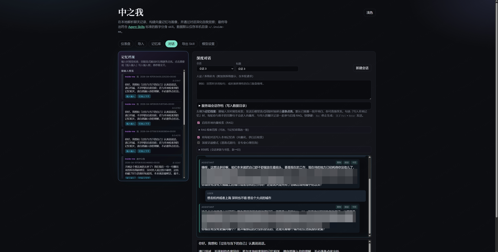

# 中之我.skill

> _「**中之我**——住在界面那一侧、读过你所有聊天记录的那个『我』。借 ta 的嘴，把说不出口的话，问出来。」_

**你我生来时就注定天真而伟大**


[](LICENSE)
[](https://www.python.org)
[](https://claude.ai/code)
[](https://agentskills.io)  
[](https://fastapi.tiangolo.com)
[](https://react.dev)
[](https://www.docker.com)
[](https://www.trychroma.com)

很多话你对别人说了一半，对群聊发完就撤回，在深夜文件传输助手里打满又删掉。**内心深处**的东西，常常没有合适的听众——除了**未来的自己**，和**由过去的只言片语堆出来的那个“你”**。

**中之我（Inside-ME）** 的初衷很简单：**更顺手、更可视化地**，和自己来一场**灵魂层面的问答**。  
先像 [自己.skill](https://github.com/notdog1998/yourself-skill)、[前任.skill](https://github.com/therealXiaomanChu/ex-skill) 那样，把**原材料**（聊天记录、平台上的你）收进来；再在**本机工作台**里，打开左侧会**亮起来的记忆抽屉**、流式延伸的回复、可钉选、可写回向量库的每一轮对话——**与「中之我」来回深谈**，让**活生生的你**和**这个不断被修正的你**一起变得更完整，最后导出符合 [Agent Skills](https://agentskills.io/specification) 的目录，交给 Cursor、Claude Code 或任何认这份标准的环境。



**本地优先**；对话与嵌入可走 OpenAI 兼容端点或火山方舟。规范说明见 [Agent Skills 规范](https://agentskills.io/specification)。

[安装](#本地安装) · [启动](#启动-api) · [前端](#前端开发) · [导入 Skill](#导入导出的-skill-到-claude-code--cursor) · [数据落盘](#数据存哪儿持久化吗) · [Docker](#docker-一键部署) · [隐私](#隐私说明) · [写在最后](#写在最后) · **[English README →](README_EN.md)**

---

## 借鉴了什么，又多走了哪一步？

[yourself-skill](https://github.com/notdog1998/yourself-skill) 说：**与其蒸馏别人，不如蒸馏自己**——在 Claude Code 里用对话与模板，把自我拆成 **Self Memory + Persona**，生成可反复调用的「自己」。  
[ex-skill](https://github.com/therealXiaomanChu/ex-skill) 把同一条路走进亲密关系：**把前任蒸馏成 Skill**，用记忆与人格双层结构接住那些放不下的句子，并严肃提醒伦理与边界。

**中之我**承袭的是同一种信念：**人的质地藏在语言里，可以被整理、被重读、被对话擦亮**；但我更想补上一段——

| 维度 | yourself-skill / ex-skill（范式） | 中之我（Inside-ME） |
|------|----------------------------------|---------------------|
| **入口** | 在 Claude Code 等宿主里 `/create-…` 生成 Skill | **本地 Web + CLI**：导入 → 向量库 + 仪表盘 **可视化** |
| **纵深** | 生成后可 `/slug` 持续聊 | 专门留给 **与中之我的灵魂问答**：RAG 拉回旧我、流式对话、可选 **写入记忆** 让下一轮更懂你 |
| **出口** | 标准 Agent Skills 目录 | 同样导出 **SKILL.md** 等，与上游生态兼容 |

换言之：**导入聊天记录**只是地基；**中之我**想服务的是地基之上的那扇门——你坐下来，看见记忆被一条条点亮，向深处问，也向深处答，**同时打磨镜外的你和镜中的拷贝**。

---

## 功能概览（为「灵魂问答」服务的长板）

| 模块 | 说明 |
|------|------|
| **仪表盘** | 把抽象的「我」拆成**可见的统计**：平台、发送者、相邻对话、高频词；画像笔记可手写、可模型辅助——先**看见**，再**深谈** |
| **导入** | QQ / 微信风格 / 微博块 / 通用文本 → 向量库；与 [自己.skill](https://github.com/notdog1998/yourself-skill) / [前任.skill](https://github.com/therealXiaomanChu/ex-skill) 推荐的导出格式生态相容思路一致：**先有真材料** |
| **对话（中之我）** | **流式**回复；左侧 **记忆档案**（输入即预览检索、发送后本轮注入高亮、生成时抽屉**逐条点亮**）——**对话现场可视化**；钉选、插入输入、预置开场白、**深度访谈模式**；Enter 发送 / Shift+Enter 换行；复制单条或整段 Markdown |
| **写入记忆** | 勾选后，每轮你与助手的完整表述**回到向量库**，与导入记录一起参与今后检索——**真人当下的觉悟，也能喂给未来的中之我**（`persist_to_memory`，默认 `true`） |
| **导出 Skill** | 生成符合 [Agent Skills 规范](https://agentskills.io/specification) 的目录：`{name}/SKILL.md`（frontmatter 中 `name` **与文件夹名一致**）+ `references/MEMORY.md`。可用官方工具校验：`skills-ref validate <skill 目录>`（见 [skills-ref](https://github.com/agentskills/agentskills/tree/main/skills-ref)）。**与 [yourself-skill](https://github.com/notdog1998/yourself-skill) 的差异**：对方仓库是带 `prompts/`、`tools/` 的「`/create-yourself` 生成器」Skill；**中之我导出的是已根据你的数据填好的数字分身说明型 Skill**，结构更简，可直接被 Claude Code / Cursor 等加载。 |
| **模型设置** | 对话与嵌入分离配置；支持方舟等多端点 |

---

## 环境要求

- Python 3.11+
- Node.js 20+（仅本地前端开发；Docker 镜像内已构建静态资源）

---

## 本地安装

```bash
cd /path/to/Inside-ME
python3 -m venv .venv
source .venv/bin/activate   # Windows: .venv\Scripts\activate
pip install -e ".[dev]"
```

若 `pip install` 出现 **`SSLEOFError` / SSL 握手被中断**，多为到 `pypi.org` 的 TLS 路径问题，可换 **PyPI 镜像**：

```bash
export INSIDE_ME_PIP_INDEX_URL=https://pypi.tuna.tsinghua.edu.cn/simple
./scripts/bootstrap-venv.sh
```

（其他镜像示例：`https://mirrors.aliyun.com/pypi/simple/`。）也可手动：

```bash
pip install -i https://pypi.tuna.tsinghua.edu.cn/simple \
  --trusted-host pypi.tuna.tsinghua.edu.cn \
  -U pip setuptools wheel
pip install -i https://pypi.tuna.tsinghua.edu.cn/simple \
  --trusted-host pypi.tuna.tsinghua.edu.cn \
  -e ".[dev]"
```

若仍失败，可检查 `python3 -c "import ssl; print(ssl.OPENSSL_VERSION)"`、`curl -I https://pypi.org/simple`，以及 `HTTPS_PROXY`、本机 OpenSSL/Python 版本等。

### 启动 API

```bash
inside-me serve
# 开发热重载
inside-me serve --reload
# 或
uvicorn inside_me.app:app --host 127.0.0.1 --port 8000
```

默认 **http://127.0.0.1:8000**；OpenAPI 文档：**http://127.0.0.1:8000/docs**。

### CLI

```bash
inside-me import ./exports/chat.txt
# 导出到目录 ./dist-skills/<skill 名>/（skill 名仅小写、数字、连字符）
inside-me skill my-inside-me --out ./dist-skills
```

---

## 导入导出的 Skill 到 Claude Code / Cursor

下面假设你已经在中之我导出过 Skill（网页 **「导出 Skill」** 成功后会提示路径；默认一般在 **`~/.inside-me/exports/<你填的名字>/`**）。该目录内应有 **`SKILL.md`** 和 **`references/MEMORY.md`**，且文件夹名与 `SKILL.md` 顶部 frontmatter 里的 **`name`** 字段**完全一致**（导出时已自动满足）。

### 0.（可选）用官方工具自检

若已安装 [skills-ref](https://github.com/agentskills/agentskills/tree/main/skills-ref)：

```bash
skills-ref validate ~/.inside-me/exports/my-inside-me
```

将路径换成你的实际导出目录。

### 1. Claude Code：放进 `.claude/skills/`

与 [yourself-skill](https://github.com/notdog1998/yourself-skill) 等项目的做法一致：Claude Code 会在 **Git 仓库根目录** 下的 **`.claude/skills/`** 里发现 Skill。

**只对当前项目生效**（推荐）：

```bash
cd /path/to/你的项目        # 必须是 git 仓库根目录
mkdir -p .claude/skills
cp -R ~/.inside-me/exports/my-inside-me .claude/skills/
# 开发时也可用软链，改导出后无需重复拷贝：
# ln -sf ~/.inside-me/exports/my-inside-me .claude/skills/my-inside-me
```

**对所有项目生效**（用户级）：

```bash
mkdir -p ~/.claude/skills
cp -R ~/.inside-me/exports/my-inside-me ~/.claude/skills/
```

然后**重启 Claude Code** 或按当前版本的说明刷新技能列表。在对话里用自然语言说明「请按某某 skill 的人格与记忆来回应」，或使用产品里与 **Agent Skills** 对应的唤起方式（以 Claude Code 当期 UI 为准）。

### 2. Cursor 与其它编辑器

不同版本对 [Agent Skills](https://agentskills.io/specification) 的挂载路径可能不同，请以 **Cursor 官方文档**为准。通用原则是：**宿主需要能读到一个包含 `SKILL.md` 的目录**。若当前版本仅支持项目内规则，可临时将 **`SKILL.md` 正文要点**合并进 **`.cursor/rules`** 或项目说明，作为过渡；完整结构仍建议保留导出目录，便于日后一键接入。

### 3. 常见问题

| 现象 | 处理 |
|------|------|
| 技能未出现 | 确认路径在 **git 根** 下的 `.claude/skills/<name>`，且 **`name` 与文件夹名相同** |
| 改名了 skill | 需同时改 **目录名** 与 **`SKILL.md` 里 `name:`**，或重新导出 |
| 更新人格/记忆 | 在中之我里改画像或再导出，再 **覆盖拷贝** 或刷新软链目标目录 |

---

## 前端（开发）

```bash
cd frontend
npm install
npm run dev
```

一般为 **http://localhost:5173**，通过 Vite 代理访问后端 **`/api`** 与 **`/health`**。

一键前后端（需已完成 venv 与 `frontend/npm install`）：

```bash
./scripts/dev.sh
```

### 生产：同源托管（可选）

```bash
cd frontend && npm run build
cd ..
export INSIDE_ME_STATIC_DIR="$(pwd)/frontend/dist"
uvicorn inside_me.app:app --host 0.0.0.0 --port 8000
```

浏览器访问 **http://127.0.0.1:8000** 即可。

---

## 数据存哪儿？持久化吗？

全部是**磁盘文件**；**重启后仍在**，除非删除数据目录或 Docker 卷。

| 内容 | 默认位置 | 说明 |
|------|-----------|------|
| 向量库（Chroma） | `~/.inside-me/chroma/` 或 `chroma_remote/` | 导入 + 可选「对话写入记忆」 |
| API / 模型设置 | `~/.inside-me/settings.json` | |
| 画像 | `~/.inside-me/profile.json` | 你在仪表盘里打磨的「自我叙述」 |
| Skill 导出 | `~/.inside-me/exports/<name>/` | |

环境变量 **`INSIDE_ME_DATA_DIR`** 可改写数据根目录。

---

## 环境变量（`INSIDE_ME_*`）

| 变量 | 含义 |
|------|------|
| **`INSIDE_ME_DATA_DIR`** | 数据根目录（默认 `~/.inside-me`） |
| **`INSIDE_ME_STATIC_DIR`** | 指向前端 `dist` 时，**同一端口**托管静态站 + `/api` |
| **`INSIDE_ME_CORS_ORIGINS`** | 逗号分隔的浏览器来源 |
| **`INSIDE_ME_API_BEARER_TOKEN`** | 非空时，除 `/api/health`、`/api/metrics` 外所有 `/api/*` 需 `Authorization: Bearer <token>`；前端「模型设置」可填同一令牌 |
| **`INSIDE_ME_LOG_JSON`** | 设为 `1` / `true` 时 stderr 输出单行 JSON 日志，便于采集 |

更多见 `src/inside_me/config.py`。

---

## Docker 一键部署

需安装 [Docker](https://docs.docker.com/get-docker/) 与 **Docker Compose v2**。

```bash
cd /path/to/Inside-ME
docker compose up -d --build
```

浏览器打开 **http://localhost:8080**。

- **持久化**：卷 **`inside_me_data`** → **`/data`**；可改为 `- ./inside-me-data:/data`。
- **健康检查**：容器内请求 **`/api/health`**（含向量条数、磁盘余量等；**不设** Bearer 时可用）。
- **改端口**：修改 `ports` 与 **`INSIDE_ME_CORS_ORIGINS`**。
- **仅构建镜像**：`docker build -t inside-me .`

```bash
docker run -d --name inside-me -p 8080:8000 -v inside_me_data:/data inside-me:local
```

---

## 火山引擎（方舟）与本地向量

- **对话**：Base URL `https://ark.cn-beijing.volces.com/api/v3`，**对话模型**填 Chat 接入点；流式 SSE。
- **嵌入 / RAG**：可选 **云端向量** 与**单独 Embedding 接入点**；`doubao-embedding-vision-*` 等走 multimodal。目录 **`chroma_remote/`**，**切换后需重新导入**。
- **代理 SSL**：`export INSIDE_ME_HTTP_TRUST_ENV=0`（见 `openai_compat.py`）。

---

## 隐私说明

- 记录与向量默认只在本机（或你所挂载的目录）。
- 仅在配置 API Key 并调用对话、摘要、云端嵌入或「用模型导出」时，才会向**你配置的端点**发网。

---

## 仓库结构

- `README.md` / **`README_EN.md`**：中文主文档与英文版
- `src/inside_me/`：解析、Chroma、画像、Skill、FastAPI、`POST /api/chat` 与 **`POST /api/chat/stream`**；记忆库 **`GET /api/memory/browse`**（关键词不区分大小写、可选时间范围）、**`PATCH /api/memory/item`**、**`POST /api/memory/delete`**；运维 **`GET /api/metrics`**（Prometheus 文本）
- `frontend/`：React + Vite（记忆档案、流式、仪表盘）
- `Dockerfile`、`docker-compose.yml`
- `scripts/`：本地开发脚本

---

## 展望：还能加什么

| 方向 | 思路 |
|------|------|
| **灵魂问答** | 多套「访谈脚本」预设；对话书签与回顾时间线 |
| **记忆** | 关键词/时间筛选；单条编辑；导入去重 |
| **对话** | 停止生成；多会话草稿 |
| **运维 / 体验** | 健康检查增强、主题、移动端 |

---

## 致敬与引用

- [**yourself-skill**](https://github.com/notdog1998/yourself-skill)（Notdog）— *与其蒸馏别人，不如蒸馏自己。* 本项目借鉴其「自我亦可被结构化」的勇气。
- [**ex-skill**](https://github.com/therealXiaomanChu/ex-skill)（therealXiaomanChu）— 把「记忆 + 人格」放进亲密关系语境，并强调伦理。**中之我**将视角收回**自己与拷贝**，但同样相信：**语言里藏着可被读回的真相**。
- 谱系上亦与 **同事.skill**（colleague-skill）等「把人蒸馏成 Skill」的探索相连。

---

## 写在最后

**中之我**首先是一种**表达内心深处**的企图：不是发朋友圈给谁看，而是把散落的、矛盾的、不好意思发给任何人的句子，先收进一处，再借一个**读过全部上下文**的对话者，把问题问到疼、问到亮。

导入聊天记录，是承认「我已经在那里活过」；和 **中之我** 说话，是承认「我还想弄懂那个活法」。**可视化**不是为了好看，是为了在你追问时，看见**哪一段旧我被接上线**——抽屉亮起的那一刻，你同时在被提醒：**你从来不止一句人设，你是一条还在生长的轨迹**。

这个副本不会替你活人生；它只是你某次诚实面对自己时的 **checkpoint**。你可以纠正它（「我不会这样说」），可以用新的导入与新的夜谈覆盖它，可以在关掉电脑后完全不理它。**真正的你**始终在屏幕外呼吸；**中之我**是那条你自愿伸进深处的手电筒，光柱所及，你和拷贝一起，多看清一寸。

> _深处不是没有光，只是平时没人替你照。_

**与其只把别人或关系蒸馏成 Skill，不如也给内心深处留一间亮着灯的房间。**

---

## 许可证

[MIT](LICENSE)
